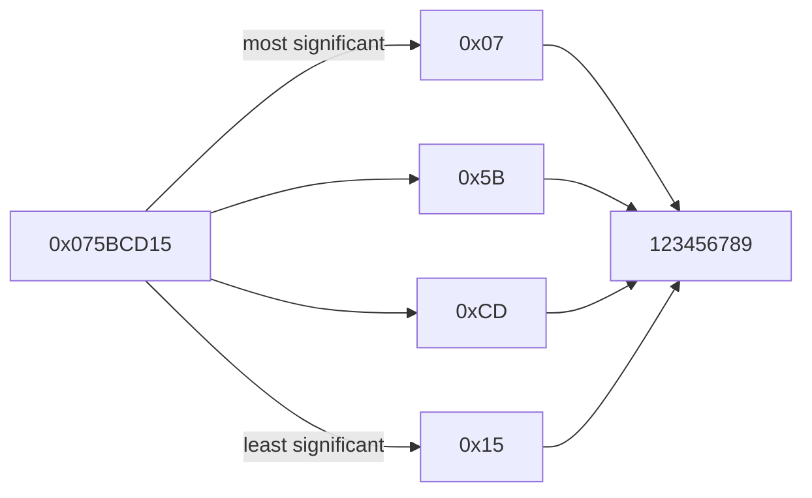
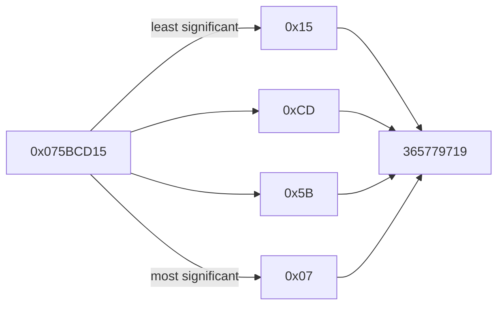

# Endianness

[Endianness](https://en.wikipedia.org/wiki/Endianness) is the order or sequence of bytes. It is primarily expressed as **big-endian (BE)** or **little-endian (LE)**. As an example, let's look at the 32-bit integer `0x75BCD15`:

The 32-bit integer `0x075BCD15` has the value `123456789` on a big-endian system.

The 32-bit integer `0x075BCD15` has the value `365779719` on a little-endian system.

## Game Version Differences

- Skyrim Legendary Edition: **big-endian**
- Skyrim Special Edition: **big-endian**
- Fallout 4: **little-endian**

The differences between the versions can be explained by looking at the target platforms:

- [PlayStation 3](https://www.psdevwiki.com/ps3/CELL_BE): **big-endian**
- [Xbox 360](https://en.wikipedia.org/wiki/Xenon_(processor)): **big-endian**
- [PlayStation 4](https://en.wikipedia.org/wiki/Jaguar_(microarchitecture)): (AMD64 x86-64) **little-endian**
- [Xbox One](https://en.wikipedia.org/wiki/Jaguar_(microarchitecture)): (AMD64 x86-64) **little-endian**
- [PlayStation 5](https://en.wikipedia.org/wiki/Zen_2): (AMD64 x86_64) **little-endian**
- [Xbox Series X/S](https://en.wikipedia.org/wiki/Zen_2): (AMD64 x86_64) **little-endian**

Aside from the PS3 and Xbox 360, all current platforms use the x86-64 architecture and little-endian. They likely didn't change the endianness of Skyrim Special Edition scripts to keep compatibility with Skyrim Legendary Edition scripts.
